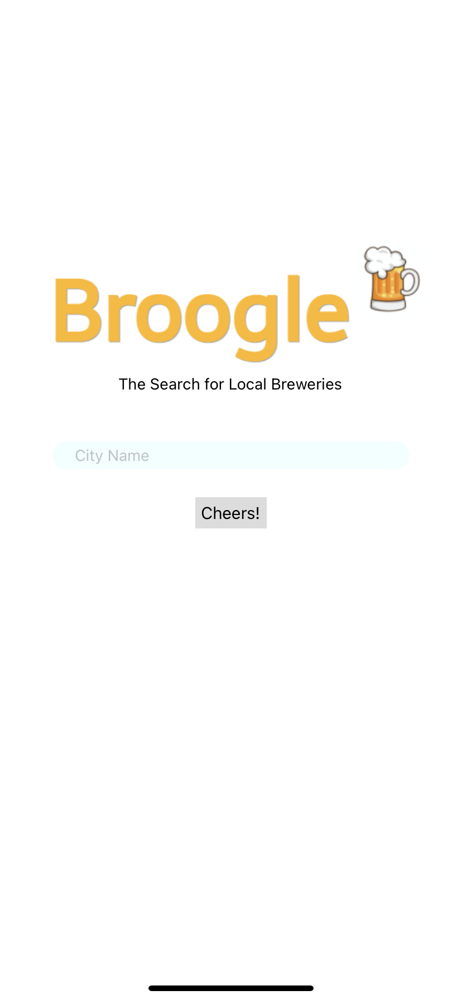
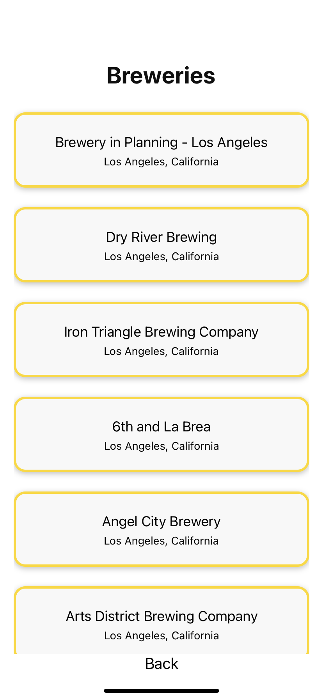

# Broogle - Mobile

A mobile version of the web application Broogle. It allows a user to search for breweries by city using the GitHub Open Brewery DB.

## Technologies Used

- JavaScript
- React Native
- Open Brewery DB

## Screenshots

Home Screen

Results Screen

## Getting Started

[Click Here](https://expo.io/@stephbarker/projects/broogle-m) to see the deployed app via Expo!

## Future Enhancements

- Allow the user to favorite breweries, and a experience a smoother flow between pages.
